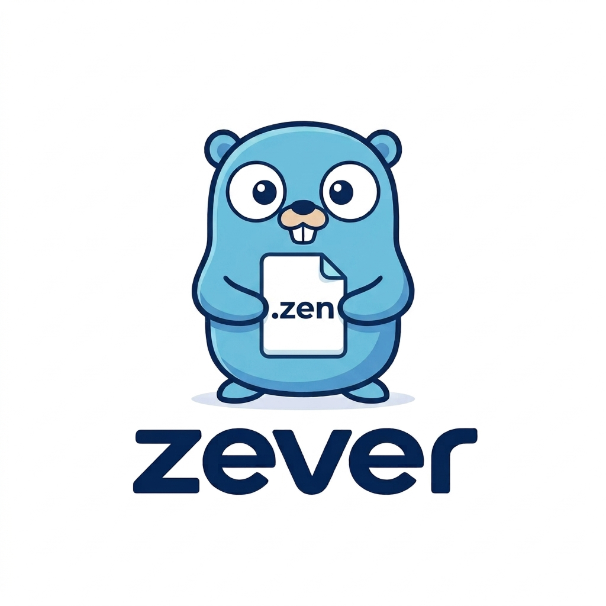

<p align="center">
  
</p>

# zever

One framework. Every backend concern. Zero rewiring.

[](https://github.com/zenta-dev/zever/actions/workflows/ci.yml)
[](https://pkg.go.dev/github.com/zenta-dev/zever)

[](https://goreportcard.com/report/github.com/zenta-dev/zever)
[](LICENSE)

## Overview

**zever** is a schema-driven scaffolding compiler for Go, built around a custom
DSL with proto-inspired syntax. You describe your services in schema files and
zever compiles that schema into the backend infrastructure your app needs:
database access, caching, queues, routing, and other cross-cutting concerns. It
deliberately stops there: it does not generate or dictate your business logic,
only the plumbing that logic runs on top of.

In one line: define a service's shape once, and zever compiles it into the
database, cache, and routing infrastructure around it, while staying completely
out of the way of the actual business logic you write on top.

## Adapters

Every backend concern is modeled as a small interface with multiple swappable
adapters. Adapters self-register, and a shared container resolves and caches
each one lazily on first use. Swapping an adapter means changing configuration,
not code.

## Configuration and wiring

Configuration layers cleanly: built-in zero-infra defaults, then a config file,
then environment variables, with strict parsing: no silent fallbacks on typos
or unknown keys. The container wires everything without globals or init-time
magic, and closes resolved adapters in correct dependency order on shutdown.

## Schema compiler

A self-contained lexer → parser → resolver → backend pipeline compiles schemas
into an intermediate representation, then emits output through pluggable
backends. The parser is fault-tolerant by design: it never panics and always
produces best-effort output plus diagnostics, even on malformed input.

## Typed ORM

zever ships a schema-first, typed SQL query builder, not raw string SQL, with
support for joins, CTEs, window functions, subqueries, upserts, and
dialect-aware capability gating, so unsupported features fail loudly rather than
emitting incorrect SQL.

## Tooling

A CLI handles scaffolding, compiling schemas, running migrations, code
generation, and serving the app. An LSP server provides editor support for the
schema language, alongside editor extensions.

## Status

zever is pre-1.0 and under active development. While below `v1.0.0`, `0.x`
releases may contain breaking changes; they are documented as such in release
notes. See [CONTRIBUTING](.github/CONTRIBUTING.md) for versioning details.

## Requirements

- Go 1.27 or newer (`go 1.27.0` in `go.mod`).

## Installation

```bash
go get github.com/zenta-dev/zever
```

## Development

Common tasks are driven by the [Makefile](Makefile). Run `make` or `make help`
to list all targets. Install the pinned development tools once with:

```bash
make setup
```

| Target | Description |
| --- | --- |
| `make build` | Build all packages |
| `make test` | Run tests |
| `make test-race` | Run tests with the race detector |
| `make bench` | Run benchmarks |
| `make cover` | Run tests with coverage and print the total |
| `make cover-html` | Open the HTML coverage report |
| `make fmt` | Check formatting (fails on unformatted files) |
| `make fmt-fix` | Format all files in place |
| `make lint` | Run `golangci-lint` |
| `make lint-fix` | Run `golangci-lint` with auto-fix |
| `make vet` | Run `go vet` |
| `make vulncheck` | Scan dependencies for known vulnerabilities |
| `make sbom` | Generate a CycloneDX SBOM (`sbom.json`) |
| `make tidy-check` | Verify `go.mod` and `go.sum` are tidy |
| `make download` | Download module dependencies |
| `make clean` | Remove generated artifacts |
| `make check` | Run all local CI checks |

`make setup` installs `golangci-lint` v2.13.2, `govulncheck` v1.8.0, and
`cyclonedx-gomod` v1.12.0. `make check` mirrors the CI pipeline and is meant to
be run before pushing. CodeQL and dependency review run only on GitHub.

## Contributing

Contributions are welcome. See [`.github/CONTRIBUTING.md`](.github/CONTRIBUTING.md)
for setup, coding standards, testing, and commit conventions.

## Community

- [Code of Conduct](.github/CODE_OF_CONDUCT.md)
- [Security policy](.github/SECURITY.md)
- [Support](.github/SUPPORT.md)
- [Discussions](https://github.com/zenta-dev/zever/discussions)

## License

Licensed under the [Apache License, Version 2.0](LICENSE).
