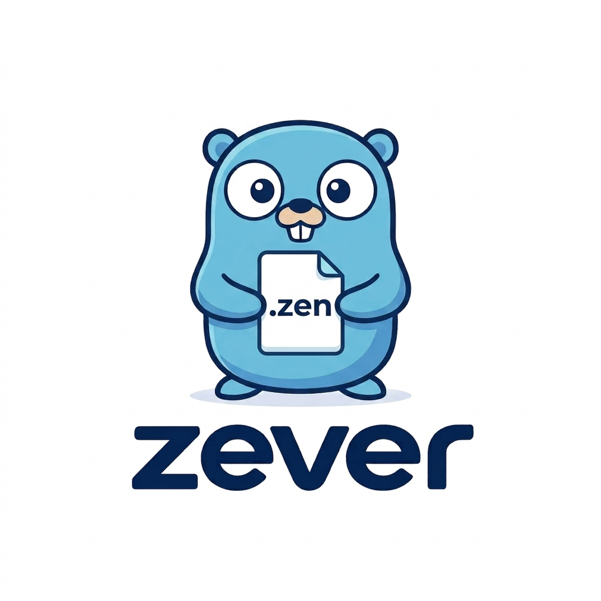

<p align="center">
  
</p>

# zever

One framework. Every backend concern. Zero rewiring.

[](https://github.com/zenta-dev/zever/actions/workflows/ci.yml)
[](https://codecov.io/gh/zenta-dev/zever)
[](https://pkg.go.dev/github.com/zenta-dev/zever)

[](.golangci.yml)
[](LICENSE)

## Why zever

Every Go backend re-solves the same plumbing: database access, caching, queues,
routing, auth, config. **zever** lets you describe your services once in a small
schema file (`.zen`, proto-inspired) and compiles that into the infrastructure
around them. It never generates or dictates your business logic, only the
plumbing that logic runs on.

- **Schema in, plumbing out.** One `.zen` file drives validation, a typed ORM,
  OpenAPI, migrations, and routes.
- **Swap infrastructure with config.** Every backend concern (db, cache, queue,
  auth, storage, ...) is a small interface with swappable adapters. Moving from
  sqlite to Postgres, or memory to Redis, is a config change.
- **Runs with zero infrastructure.** Defaults are sqlite, in-memory and local
  adapters, so you can start without Docker or external services.
- **Your logic stays yours.** No generated business code to fight or regenerate over.

## Install

Linux, macOS, or Windows (Git Bash). Installs `zever` and `zever-lsp` to
`~/.local/bin` (no sudo), verifies SHA-256 checksums, and adds it to your `PATH`:

```bash
curl -fsSL https://raw.githubusercontent.com/zenta-dev/zever/main/install.sh | sh
```

Windows (PowerShell):

```powershell
irm https://raw.githubusercontent.com/zenta-dev/zever/main/install.ps1 | iex
```

Prefer to read the script first? Download it and run `sh install.sh --dry-run`.
Other flags: `--version vX.Y.Z`, `--prefix DIR`, `--yes`, `--force`. Then check it works:

```bash
zever --version
zever upgrade      # later: move to the latest release
zever uninstall    # remove the binaries
```

More options (release binaries, Windows, uninstall):
[Installation guide](https://zenta-dev.github.io/zever/start/installation/).
You need Go 1.27+ to build the apps zever scaffolds.

## Quickstart: schema to database in 2 minutes

Scaffold a project:

```bash
zever new hello --dir ./hello --force
cd hello
```

Replace `schema/app.zen` with one entity and two RPCs:

```zen
entity Task {
  id: uuid @primary
  title: string @validate(min_len: 1, max_len: 200)
  done: bool
  created_at: timestamp @default(now())
}

service TaskService {
  rpc CreateTask(title: string) -> Task {
    http: POST "/v1/tasks"
    auth: required
  }

  rpc ListTasks() -> Task {
    http: GET "/v1/tasks"
    auth: required
    paginated: true
  }
}
```

Validate it, generate code, preview the SQL, then create the database:

```bash
zever check schema/app.zen
zever compile --backend=zenorm,atlas,openapi --out ./generated schema/app.zen
zever db migrate --dry-run --adapter=sqlite schema/app.zen
zever db migrate --adapter=sqlite --dsn=data/app.db schema/app.zen
```

You now have a typed ORM, an OpenAPI document, and a sqlite database with a
`tasks` table, all derived from that one schema.

**See a full running server.** `examples/todo` is a small auth-gated notes API
(HTTP on `:8080`, gRPC on `:9090`):

```bash
git clone https://github.com/zenta-dev/zever && cd zever/examples/todo
export AUTH_JWT_SECRET='replace-with-at-least-32-random-bytes'
zever db migrate --adapter=sqlite --dsn=data/app.db schema/todo.zen
go run ./cmd/server -addr :8080
```

In another terminal: `curl -i localhost:8080/healthz` returns `200 OK`. The
generated `hello` project is a bare starting point: `zever serve` needs the
auth and permission batteries wired first (see the [booking tutorial](https://zenta-dev.github.io/zever/tutorials/build-a-booking-api/)).

## Where next

| I want to... | Go to |
| --- | --- |
| Follow the full tutorial | [Quickstart](https://zenta-dev.github.io/zever/start/quickstart/) and [Build a booking API](https://zenta-dev.github.io/zever/tutorials/build-a-booking-api/) |
| Understand how it fits together | [How zever works](https://zenta-dev.github.io/zever/concepts/how-zever-works/) |
| Browse every command | [CLI reference](https://zenta-dev.github.io/zever/reference/cli/) |
| See a bigger app | [`examples/showcase`](examples/showcase/README.md) (shop app with Dockerfile) |
| Get editor support | [LSP and editor extensions](https://zenta-dev.github.io/zever/guides/extend/editor-setup/) |

## Adapters

Every backend concern is modeled as a small interface with multiple swappable
adapters. Adapters register explicitly via each adapter module's `Register()`
call, and a shared container resolves and caches
each one lazily on first use. Swapping an adapter means changing configuration,
not code.

## Configuration and wiring

Configuration layers cleanly: built-in zero-infra defaults, then a config file,
then environment variables, with strict parsing: no silent fallbacks on typos
or unknown keys. The container resolves only explicitly registered adapters, without globals or init-time
magic, and closes resolved adapters in correct dependency order on shutdown.

## Schema compiler

A self-contained lexer → parser → resolver → backend pipeline compiles schemas
into an intermediate representation, then emits output through pluggable
backends. The parser is fault-tolerant by design: it never panics and always
produces best-effort output plus diagnostics, even on malformed input.

## Typed ORM

zever ships a schema-first, typed SQL query builder, not raw string SQL, with
support for joins, CTEs, window functions, subqueries, upserts, and
dialect-aware capability gating, so unsupported features fail loudly rather than
emitting incorrect SQL.

## Tooling

A CLI handles scaffolding, compiling schemas, running migrations, code
generation, and serving the app. An LSP server provides editor support for the
schema language, alongside editor extensions.

## Status

zever is pre-1.0 and under active development. While below `v1.0.0`, `0.x`
releases may contain breaking changes; they are documented as such in release
notes. See [CONTRIBUTING](.github/CONTRIBUTING.md) for versioning details.

## Requirements

- Go 1.27 or newer (`go 1.27.0` in each module's `go.mod`; `go.work` wires local dev).

## Using zever packages as a library

Each battery is its own Go module, so you depend only on what you use:

```bash
go get github.com/zenta-dev/zever/core/cache
```

## Development

Common tasks are driven by the [Makefile](Makefile). Run `make` or `make help`
to list all targets. Install the pinned development tools once with:

```bash
make setup
```

| Target | Description |
| --- | --- |
| `make build` | Build all packages |
| `make test` / `make test-race` | Run tests (optionally with the race detector) |
| `make fmt-fix` | Format all files in place |
| `make lint` | Run `golangci-lint` |
| `make generate` | Regenerate editor grammar files after DSL keyword/scalar changes |
| `make check` | Run all local CI checks |

Other targets (coverage, benchmarks, SBOM, `deps-sync`, `modgraph-check`, ...) are
listed by `make help`.

`make setup` installs `golangci-lint` v2.14.0, `govulncheck` v1.8.0, and
`cyclonedx-gomod` v1.12.0. `make check` mirrors the CI pipeline and is meant to
be run before pushing. CodeQL and dependency review run only on GitHub.

## Documentation

Full guides live at <https://zenta-dev.github.io/zever/>. Run locally with:

```bash
cd docs && npm run dev
```

## Contributing

Contributions are welcome. See [`.github/CONTRIBUTING.md`](.github/CONTRIBUTING.md)
for setup, coding standards, testing, and commit conventions.

## Community

- [Code of Conduct](.github/CODE_OF_CONDUCT.md)
- [Security policy](.github/SECURITY.md)
- [Support](.github/SUPPORT.md)
- [Discussions](https://github.com/zenta-dev/zever/discussions)

## License

Licensed under the [Apache License, Version 2.0](LICENSE).
